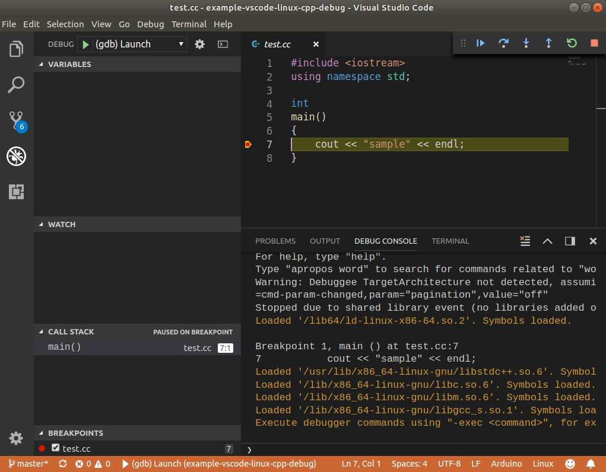

# example-vscode-linux-cpp-debug

skeleton of c++ application in linux using makefile and vscode debug

## prerequisites

- install [vscode](https://code.visualstudio.com/)
- install gcc and gdb
- install vscode extension [easy c++ project](https://github.com/acharluk/easy-cpp-projects)

## create new project

- [F1] easy cpp ( select `Easy Cpp/C++: Create new C++ project` )
  - `G++/GDB Linux`

## test breakpoint

- hit `F9` on row to set breakpoint

## troubleshoot

- using vscode 1.30 gives an [error](https://github.com/Microsoft/vscode/issues/64948) when starting debug `Stopping due to fatal error: NullReferenceException: Object reference not set to an instance of an object`
  - solve by setting "externalConsole" to false in `.vscode/launch.json`
